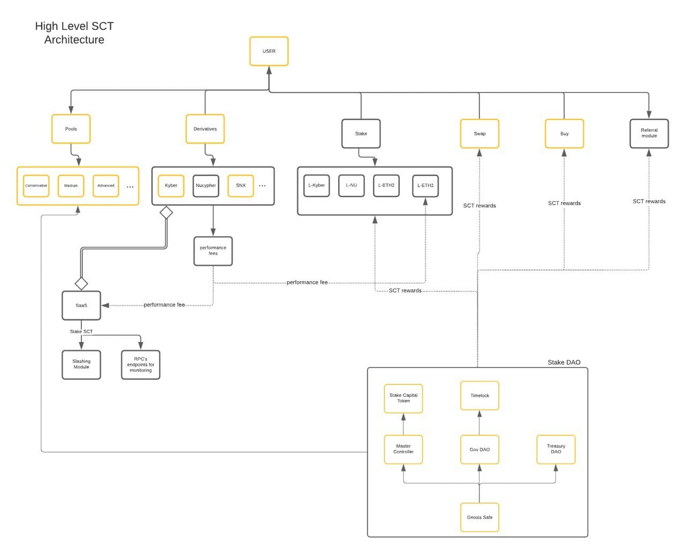

# protocol

> Contracts managing Stake DAO

## Diffcheckers
1. SushiBar-Sanctuary: https://www.diffchecker.com/LNghRNOO
2. Synthetix Rewards Contract - Sanctuary (for newly added notifyRewardAmount() in Sanctuary.sol): https://etherscan.io/address/0xdcb6a51ea3ca5d3fd898fd6564757c7aaec3ca92#code
3. LPGenesisPool-StakedaoNFTPalace: https://www.diffchecker.com/NIJG4nn3


## Architecture



## Project Structure

Refer to [eth-brownie documentation](https://eth-brownie.readthedocs.io/en/stable/structure.html).

## Requirements

### Install

- [Python3](https://www.python.org/download/releases/3.0/)
- [eth-brownie](https://eth-brownie.readthedocs.io/en/stable/install.html) **strictly `1.12.0` or above**
- Node.js 10.x development environment (for Ganache).
- Ganache (v6.12.1)

### Run

```bash
git clone https://github.com/StakeDAO/protocol
cd protocol
yarn install --lock-file
pip install -r requirements-dev.txt
```

## Compiling Contracts

Run the following command to compile the contracts.

```
brownie compile --all
```

## Deploying Contracts

### DEV

The deployment scripts can be found in the [scripts/deploy/dev](./scripts/deploy/dev) folder.

To run the deployment script, run:

```
python scripts/deploy/dev/deploy.py
```

### PROD

The deployment scripts can be found in the [scripts/deploy/prod](./scripts/deploy/prod) folder.

To run the deployment script, follow the steps:

1. Step up the `stakedao-deployer-rug-pull` account:

```
brownie accounts new stakedao-deployer-rug-pull
```

2. Make sure that all the parameters have been setup in `config.json` file:

3. Make sure you have enough ETH (maybe 2 ETH) in the deployer account.

4. Run the script to start deployment:

```
python scripts/deploy/prod/deploy.py
```

## Funding Contributors

Run the following scripts to fund contributors.

```
brownie run scripts/contributors/fund.py
```

## Running Tests

Run tests:

```bash
brownie test -s
```

Run tests with coverage:

```bash
brownie test -s --coverage
```

### Polygon

1. Setup network:

```bash
brownie networks add development polygon-fork cmd=ganache-cli host=http://127.0.0.1 fork=https://rpc-mainnet.maticvigil.com/ accounts=10 mnemonic=brownie port=8545
```

2. Run Tests
```bash
brownie test tests/polygon --network polygon-fork
```


## Formatting

Check linter rules for `*.json` and `*.sol` files:

```bash
yarn lint:check
```

Fix linter errors for `*.json` and `*.sol` files:

```bash
yarn lint:fix
```

Check linter rules for `*.py` files:

```bash
black . --check --config black-config.toml
```

Fix linter errors for `*.py` files:

```bash
black . --config black-config.toml
```

## Steps to run dev deployment

All the prod deployment scripts are in [prod folder](./scripts/prod).

1. Add a `mnemonic.txt` file in the root folder of the project.

2. Start a network remote/local (eg. local mainnet fork).

```
ganache-cli --port 8545 --gasLimit 12000000 --accounts 10 --hardfork istanbul --mnemonic brownie --fork https://mainnet.infura.io/v3/4b7b9649ead646dcb583a25f19831bef
```

3. Run the following script in the terminal: `python scripts/deploy/dev/deploy.py YOUR_NETWORK`

## Steps to run prod deployment

1. Setup a `stakedao-deployer-rug-pull` account:

```
brownie accounts new stakedao-deployer-rug-pull
```

2. Run the following script in the terminal: `python scripts/deploy/prod/deploy.py`

## Steps to generate airdrop merkle json

Run the following script:

```
brownie run scripts/airdrop/airdrop-json-generator.py
```

**The script will output the number of airdrop addresses and the final merkle root hash.**
